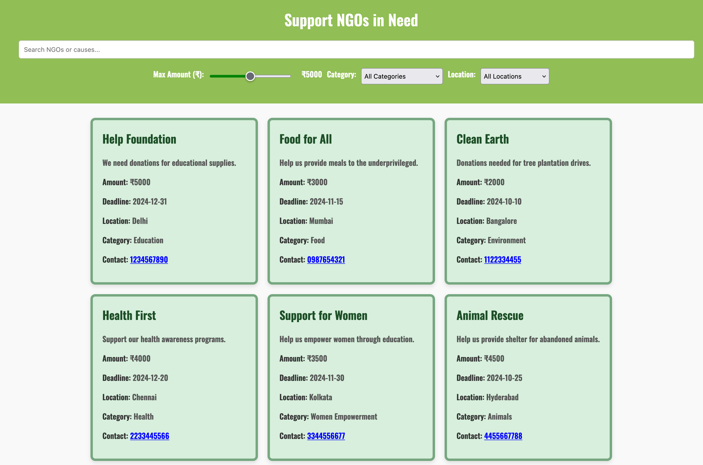

# Donify

**Donify** is an initiative aimed at organizing donations in India, allowing organizations to post their donation needs while enabling donors to filter and contribute based on their preferences. The platform facilitates a seamless connection between NGOs and individuals, making the process of donating easier and more efficient.

## Table of Contents

- [Features](#features)
- [Technologies Used](#technologies-used)
- [Installation](#installation)
- [Usage](#usage)

## Start Point

To start with the project, clone the repository and navigate to the project directory.

Filename - index.html

## Project Highlight



## Features

- **User-Friendly Interface:** An intuitive interface that allows users to easily navigate through donation options.
- **Donation Filtering:** Donors can filter donation requests based on categories, urgency, and other criteria to find causes that resonate with them.
- **Organizational Dashboard:** Organizations can manage their donation requests, track contributions, and update their needs.
- **Responsive Design:** Optimized for mobile and desktop views, ensuring a smooth experience across devices.

## Technologies Used

- **HTML:** For the structure of the web pages.
- **CSS:** For styling the application and creating a responsive layout.
- **JavaScript:** For interactivity and dynamic content management.
- **Local Storage:** For data persistence between sessions.

## Installation

To run Donify locally, follow these steps:

1. **Clone the repository:**
   ```bash
   git clone https://github.com/yourusername/donify.git
   ```
